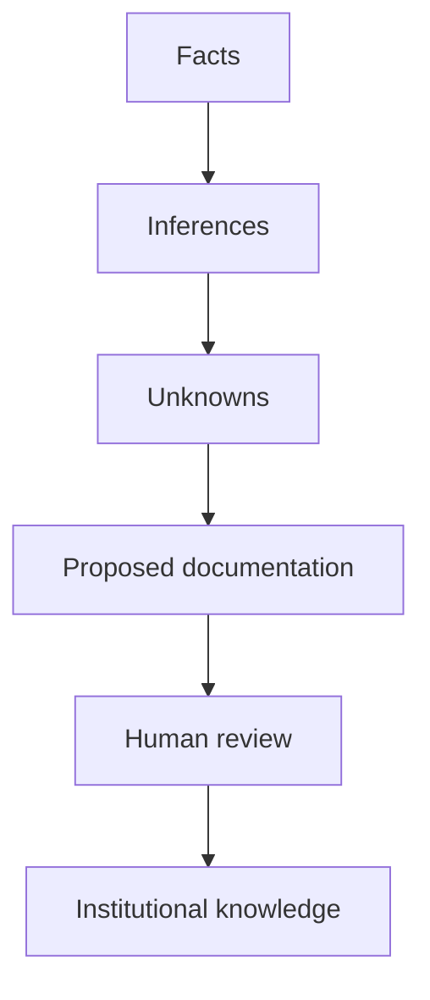

# Ice Breaker

<div class="grid grid-cols-2 gap-8 items-center justify-center mt-12">
  <div>
    <h2 class="!text-3xl text-gray-500 mb-8">Do you know these?</h2>
    <div class="flex flex-wrap justify-center gap-6">
      
      
      
      
      
    </div>
  </div>
  
  <div class="border-l border-gray-300 pl-8 relative">
    <div class="absolute -left-[22px] top-1/2 -translate-y-1/2 bg-white px-2 text-2xl font-bold text-gray-400">VS</div>
    <h2 class="!text-3xl text-gray-500 mb-8">Do you know this?</h2>
    <div class="flex flex-col items-center justify-center">
      
      <div class="font-mono text-2xl font-bold text-[#e24329] bg-gray-100 px-6 py-4 rounded-xl border border-gray-200">
        cvc-shared-tools
      </div>
    </div>
  </div>
</div>

<!--
~2 min
Open by asking the audience if they recognize the AI logos on the left.
Then ask if they know what cvc-shared-tools is.
-->

---
layout: statement
---

# Climate adaptation vs. Code adaptation

"We model climate adaptation, but how does our modeling code adapt?"

<div class="mt-8 text-xl text-gray-500 font-serif">
Reference: <em>Agentic Workflows for Climate Modeling</em> (arXiv:2606.25076)
</div>

<!--
~1 min
The climate changes. Our code changes to adapt. But who helps the code adapt?
We need standards, common infra patterns, and standard practices to avoid drowning in maintenance.
-->

---

# 3. Why `cvc-shared-tools` exists

<div class="grid grid-cols-2 gap-8 mt-10">
<div>

### The Problem
- **No discoverability:** Useful scripts are scattered in personal `/gpfs/scratch/` dirs.
- **Copy-paste culture:** Workflows branch and diverge.
- **Lost knowledge:** When authors leave, scripts are abandoned.
- **Brittle parameters:** Hardcoded absolute paths and modules break after HPC updates.

</div>
<div>

### The Solution (`cvc-shared-tools`)
A centralized, curated repository for:
- Pre-processing tools
- Interpolation workflows
- Common Earth System scripts

**Goal:** Almost-zero-cost maintenance through standard practices and automated documentation.

</div>
</div>

<!--
~2 min
Explain the core motivation. The problem is institutional memory and maintenance debt.
-->

---

# 4. Standardizing the workflow contract

To fix the maintenance burden, every workflow must have a **machine-readable contract**: `metadata.yaml`.

```yaml
schema_version: "1.0"
workflow:
  name: "en4-to-orca"
  description: "Interpolates EN4 ocean data to ORCA grids"
environment:
  target_platform: "mn5"
  modules:
    - "netcdf/4.7"
    - "cdo"
    - "sosie"
execution:
  script: "scripts/run.sh"
```

<v-click>

This `metadata.yaml` drives **everything**: CI checks, index generation, and agent ingestion.

</v-click>

---

# 5. The Workflow Architecture

```text
                       CVC WORKFLOWS
                             │
                 ┌───────────┴────────────┐
                 │                        │
             BSC-ES GitHub             AI Agents
                 │                        │
        ┌────────┼────────┐       ┌───────┼────────┐
        │        │        │       │       │        │
      Code      Docs     Tests   Intake  Review  Repair
        │        │        │       │       │        │
        └────────┴────────┴───────┴───────┴────────┘
                             │
                       Pull Requests
                             │
                 ┌───────────┴────────────┐
                 │                        │
          Auto-Rebuilt Docs      Ephemeral BSC Runners
```

<div class="text-center mt-4 text-gray-500 italic">
An ecosystem where AI proposes structure and humans validate science.
</div>

---
layout: default
---

# 6. Free, Auto-Rebuilding Documentation

<div class="grid grid-cols-2 gap-8 mt-8">

<div>

### Zero Manual Copy-Paste
- Scientist pushes `metadata.yaml` updates.
- CI script (`update_workflows_index.py`) runs on every commit.
- Automatically generates `WORKFLOWS.md`.

</div>

<div class="bg-gray-50 p-6 rounded-lg border border-gray-200 shadow-sm">

### The Resulting Portal
- **Searchable:** Filter by `MN5`, `CDO`, `NEMO`.
- **Status Badges:** See validation state instantly.
- Rebuilt in **3 seconds**.
- Hosted on ReadTheDocs for **free**.

</div>
</div>

<!--
~2 min
Scientists hate writing documentation. When they update a script parameter, they never update the wiki.
With this system, when they update the script's `metadata.yaml`, the documentation updates automatically.
-->

---

# 7. Trust has multiple dimensions

A workflow can be:

| Dimension | State |
|---|---|
| **Documentation** | `reviewed` |
| **Software checks** | `passed` |
| **Scientific validation** | `required` |
| **Reproducibility** | `partial` |
| **HPC environment** | `unknown` |
| **Maintenance** | `current` |

Do **not** collapse all of this into one `status: verified`.

Distinguish:
**Observed → mechanically checked → human reviewed → scientifically validated**

<!--
~1.5 min
This slide prevents the "green badge = scientifically correct" failure mode.
-->

---

# 8. AI is not the source of truth

The agent should create:



**Observed:** `perturb.py` adds `0.1` to temperature.
**Not established:** `0.1` is scientifically justified.

The system must be allowed to say: **"We do not know."**

---

# 9. What an ingestion interaction looks like

A scientist submits a GitHub issue:

> *"Please ingest workflows/prediction-data/foo for reuse."*

<div class="grid grid-cols-2 gap-8 mt-8">
<div>

**The Pipeline:**
1. gh-aw + LLM (Claude/Gemini)
2. inspect repository & extract evidence
3. generate metadata & docs
4. run deterministic checks
5. draft pull request
6. human review

</div>
<div class="bg-[#f6f8fa] p-4 rounded-lg">

**The Interface:**
The scientist does **not** need to learn an AI framework. 

**GitHub is the interface.**

</div>
</div>

---

# 10. The user can choose any local AI agent

Climate Commons should **not** own a local AI runtime.

<div class="flex gap-4 mt-8">
  <div class="flex-1 bg-white border border-gray-200 p-6 rounded-lg shadow-sm">
    <h3 class="!text-lg">Institutional automation</h3>
    <p class="text-sm text-gray-500">= GitHub + gh-aw + Gemini</p>
  </div>
  
  <div class="flex-1 bg-white border border-gray-200 p-6 rounded-lg shadow-sm">
    <h3 class="!text-lg">Personal productivity</h3>
    <p class="text-sm text-gray-500">= scientist's preferred agent</p>
    <div class="flex gap-2 mt-2">
      <span class="px-2 py-1 bg-blue-100 text-blue-800 rounded text-xs">agy / Antigravity</span>
      <span class="px-2 py-1 bg-blue-100 text-blue-800 rounded text-xs">Copilot</span>
      <span class="px-2 py-1 bg-blue-100 text-blue-800 rounded text-xs">Claude Code</span>
    </div>
  </div>
</div>

**The repository should not care which local agent produced a Git diff.**
It supplies the contract (`AGENTS.md`, schemas, CI checks).

---

# 11. Security & Safety Boundaries

<div class="grid grid-cols-2 gap-8 mt-8">
<div>

### Agents may ✅
- inspect code and docs
- generate metadata
- propose documentation
- detect drift & propose fixes
- create draft PRs

</div>
<div>

### Agents may not ❌
- merge to `main` autonomously
- launch production HPC jobs
- change scientific methodology
- modify production infrastructure
- access unrestricted secrets

</div>
</div>

<div class="mt-8 text-center bg-red-50 text-red-900 py-3 rounded-lg border border-red-200 font-semibold">
The intended control loop is: Read → Reason → Propose → Check → Review → Merge
</div>

---

# 12. What the prototype will actually test

## First vertical slice

**Workflow ingestion + reuse documentation** (Start with ~10 workflows).

### Success is not "the README looks good."
Success is:

> **Can another scientist use the workflow without asking its original author the basic questions?**

---

# 13. What comes after the first vertical slice?

<div class="mt-8 space-y-6">

<div class="border-l-4 border-blue-500 pl-6">
  <h3 class="!text-xl font-semibold">C — Maintenance</h3>
  <p class="text-gray-600">Use scheduled agents to detect documentation drift, broken links, stale dependencies, and orphaned workflows.</p>
</div>

<div class="border-l-4 border-purple-500 pl-6">
  <h3 class="!text-xl font-semibold">D — Infrastructure migration</h3>
  <p class="text-gray-600">Identify workflows affected by HPC changes, compare environment assumptions, and prepare migration PRs.</p>
</div>

</div>

<div class="mt-12 text-center text-gray-500 font-semibold italic">
Do not build C or D until ingestion demonstrates value.
</div>

---

# 14. Why this can stay low-maintenance

The system deliberately avoids becoming a platform to operate.

<div class="grid grid-cols-2 gap-8 mt-8">
<div>

### ❌ No
- custom web application
- always-on agent service
- vector database / RAG backend
- mandatory local CLI
- autonomous HPC service

</div>
<div>

### ✅ Yes
- GitHub & GitHub Actions
- `gh-aw`
- Repository metadata
- Deterministic CI
- Pull requests

</div>
</div>

Git remains the durable artifact. Agent vendors remain replaceable.

---

# 15. The first implementation steps

<div class="grid grid-cols-3 gap-6 mt-8">
  <div class="bg-gray-50 p-4 rounded-lg">
    <h3 class="!text-lg !mb-4">Phase 0<br><span class="text-sm font-normal text-gray-500">Repository Trust</span></h3>
    <ul class="text-sm space-y-2">
      <li>• Protect main branch</li>
      <li>• Pin Actions</li>
      <li>• Establish security files</li>
    </ul>
  </div>
  <div class="bg-gray-50 p-4 rounded-lg">
    <h3 class="!text-lg !mb-4">Phase 1<br><span class="text-sm font-normal text-gray-500">Deterministic Base</span></h3>
    <ul class="text-sm space-y-2">
      <li>• Workflow schemas</li>
      <li>• Auto-index scripts</li>
      <li>• CI checks setup</li>
    </ul>
  </div>
  <div class="bg-gray-50 p-4 rounded-lg">
    <h3 class="!text-lg !mb-4">Phase 2<br><span class="text-sm font-normal text-gray-500">Agentic Prototype</span></h3>
    <ul class="text-sm space-y-2">
      <li>• Install gh-aw</li>
      <li>• Read-only health audits</li>
      <li>• Ingestion → Draft PR</li>
    </ul>
  </div>
</div>

---
layout: center
class: text-center
---

# 16. Decision criteria

Does it save time? • Does it improve reuse? • Does it reduce knowledge debt?

> **"The project succeeds when the repository becomes more useful than the sum of the scripts inside it."**

### Join the effort
`https://gitlab.earth.bsc.es/cvc/cvc-shared-tools.git`

---
layout: end
---

# Thank You

**Questions & Discussion**
